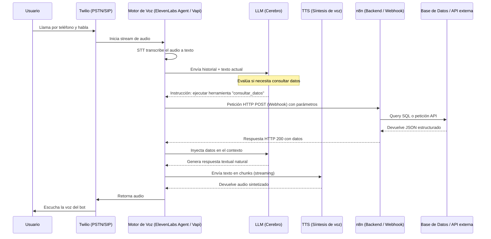

# Documentación: Agente Telefónico con IA (Voice Bot) — n8n + Telefonía + Voz Conversacional

**Versión:** 2.0 (fusión de investigación propia + documento de arquitectura de producción)
**Última actualización:** 21 de julio de 2026
**Estado:** Investigación / propuesta técnica — pendiente de aprobación

---

## Alcance y supuestos de este documento

- Los precios de telefonía asumen **números de EE. UU.**; si el proyecto opera en otro país, las tarifas de Twilio cambian y deben recotizarse.
- Los tiempos estimados de desarrollo asumen un desarrollador con **nivel avanzado** en n8n, APIs y webhooks.
- No se cubre en detalle: cumplimiento normativo específico por país (protección de datos, grabación de llamadas), ni integración con sistemas internos particulares del cliente final (se usa Google Sheets/CRM genérico como ejemplo).
- Los precios de los proveedores (Twilio, ElevenLabs, Vapi, OpenAI, Anthropic) son cifras de mercado a la fecha de este documento y **cambian con frecuencia**; se recomienda validar en la página oficial de cada proveedor antes de cerrar presupuesto.
- Se presentan **dos variantes de arquitectura** (integrada vs. modular) para que la decisión final se tome con el trade-off completo sobre la mesa.

---

## 1. Resumen ejecutivo

El objetivo es construir un sistema que conteste llamadas telefónicas de forma automática, manteniendo una **conversación fluida y natural** con el cliente (sin menús tipo "marque 1 para..."), capaz de recolectar información por llamada, y con soporte para distintas voces y tonos.

El diseño se basa en **desacoplar el procesamiento de audio en tiempo real de la lógica de negocio**: un motor de voz conversacional (STT + LLM + TTS) lleva la conversación en vivo con latencia ultrabaja y manejo natural de interrupciones (barge-in), mientras que **n8n actúa como backend de lógica transaccional** (agendar, consultar datos, guardar información), conectado mediante webhooks. Este enfoque supera las limitaciones de los IVR tradicionales y evita construir desde cero un sistema de streaming de audio, que es ingeniería de alta complejidad.

| Aspecto | Resumen |
|---|---|
| Stack principal (recomendado) | Twilio + ElevenLabs Conversational AI + n8n |
| Stack alternativo (más control, más piezas) | Twilio (SIP Trunk) + Vapi/Retell (orquestador) + LLM + ElevenLabs/Cartesia (voz) + n8n |
| Tiempo MVP | 3–5 días (8h/día, nivel avanzado) |
| Tiempo versión vendible | 6–9 días |
| Costo por minuto de llamada | $0.08–$0.19 según arquitectura elegida |
| Costo fijo mensual mínimo | ~$120–150/mes (VPS + plan de voz + número Twilio) |
| Mayor riesgo técnico | Latencia en producción con múltiples llamadas simultáneas |
| Mayor riesgo de negocio | Licencia de n8n si se expone a clientes finales |

---

## 2. Casos de uso de negocio

Esta arquitectura es agnóstica a la industria:

1. **Atención al cliente Nivel 1 (inbound):** preguntas frecuentes, estado de pedidos, horarios, políticas. Derivación a humano si el sentimiento es negativo o el problema es complejo.
2. **Agendamiento automático de citas:** clínicas, salones, servicios profesionales — verifica disponibilidad en tiempo real vía n8n y reserva el espacio.
3. **Cobranzas y recordatorios (outbound):** llamadas proactivas de pago vencido, con opciones de regularización integradas a pasarelas de pago.
4. **Calificación de leads (ventas):** contacto inmediato tras un formulario web; si el lead califica, transfiere a un cerrador humano.
5. **Soporte técnico de triaje:** identificación preliminar del problema, recolección de datos (número de serie, tipo de error), creación de tickets en Jira/Zendesk.

---

## 3. Arquitectura y flujo del sistema

### Principio de arquitectura clave

**n8n no procesa audio en tiempo real.** Sus workflows se disparan por eventos/webhooks, no manejan streams continuos de voz con baja latencia. Por eso el sistema se divide en dos capas: un **motor de voz conversacional** que lleva la conversación en vivo, y **n8n** como backend al que ese motor le pide datos/acciones cuando los necesita.

### Diagrama de flujo (llamada entrante)



### Workflow 1 — "Tools" (durante la llamada, tiempo real)
- **Webhook Trigger (POST)**, configurado como Server Tool del agente, en modo "Respond to Webhook".
- **Switch/IF** para bifurcar según qué herramienta pidió el agente (agenda, CRM, base de datos, etc.).
- **Nodos de lógica de negocio**: Google Calendar, Google Sheets, HTTP Request, CRM.
- **Respond to Webhook**: regresa un JSON corto y rápido para que el agente continúe hablando sin pausas largas.
- Requiere `idempotency_key`/`correlation_id` para evitar duplicados por reintentos de red.

### Workflow 2 — "Post-call" (al terminar la llamada)
- **Webhook Trigger**: recibe transcripción completa, duración, costo, resultado.
- **Set/Edit Fields**: extrae los datos relevantes.
- **(Opcional) Nodo de IA**: resume o clasifica sentimiento/intención.
- **Guardado**: Google Sheets / Airtable / base de datos / CRM.
- **(Opcional) Notificación**: Slack, WhatsApp, email.

### Workflow 3 — Administración
Gestión de prompts, cambios de voz, actualización de base de conocimiento (RAG). No corre por llamada, es de uso interno.

### Manejo de latencia e interrupciones (barge-in)
- **Streaming en cascada:** el motor de voz no espera a que el LLM termine la oración completa; en cuanto genera las primeras palabras, las manda al TTS y el audio se envía de inmediato.
- **Frases de relleno:** si n8n demora más de ~1 segundo en responder, el motor de voz puede emitir un audio pre-cacheado tipo *"dame un segundo que reviso el sistema..."* para evitar silencios muertos.
- **Barge-in:** si el usuario interrumpe al bot, el VAD corta el audio instantáneamente, descarta lo no dicho y vuelve a escuchar.

---

## 4. Ejemplo concreto de conversación (caso: agendamiento de cita)

```
Cliente:  Hola, quería ver si tienen disponibilidad para mañana en la tarde.
Agente:   Claro, dame un segundo que reviso la agenda...
          [dispara Workflow 1 → tool "consultar_disponibilidad" → n8n consulta
           Google Calendar → responde: {"disponible": true, "horarios": ["15:00", "16:30"]}]
Agente:   Tengo espacio mañana a las 3 de la tarde o a las 4:30. ¿Cuál prefieres?
Cliente:  A las 3 está bien.
Agente:   Perfecto, ¿me confirmas tu nombre completo para la reserva?
Cliente:  Juan Pérez.
          [dispara Workflow 1 → tool "crear_cita" → n8n crea el evento en Calendar
           y guarda el registro → responde: {"status": "confirmado", "id": "abc123"}]
Agente:   Listo Juan, quedaste agendado para mañana a las 3 de la tarde. Te va a
          llegar una confirmación. ¿Necesitas algo más?
Cliente:  No, gracias.
Agente:   Que tengas buen día.
          [llamada termina → dispara Workflow 2 → n8n guarda transcripción,
           duración, resultado: "cita agendada", en la hoja de seguimiento]
```

Este ejemplo ilustra por qué el diseño separa "conocimiento estático" (el agente ya sabe que puede ofrecer citas) de "acciones dinámicas" (consultar disponibilidad real y crear el evento sí requieren ir a n8n).

---

## 5. Stack tecnológico: dos variantes de arquitectura

### Variante A — Integrada (recomendada para MVP y equipos pequeños)

| Tecnología | Rol | Por qué |
|---|---|---|
| **Twilio** | Telefonía (número + enrutamiento) | Estándar de la industria, integración nativa con ElevenLabs sin configurar TwiML manualmente |
| **ElevenLabs Conversational AI** | Motor todo-en-uno (STT + LLM orquestado + TTS) | Mejor naturalidad de voz del mercado, 31+ idiomas, un solo proveedor que simplifica facturación y mantenimiento |
| **n8n** | Backend de lógica de negocio | Visual, conecta a cientos de sistemas sin backend a medida |

**Ventaja:** menos proveedores, menos puntos de falla, más rápido de poner en marcha.
**Desventaja:** menos control sobre qué STT/LLM/TTS específico se usa internamente.

### Variante B — Modular (más control, para equipos con capacidad de ingeniería)

| Tecnología | Rol | Por qué |
|---|---|---|
| **Twilio (SIP Trunking)** | Telefonía | Igual que en variante A; enruta el tráfico vía SIP directo a la nube, sin hardware PBX |
| **Vapi o Retell AI** | Orquestador de voz (gestiona WebSockets, VAD, sincronización) | Permite mezclar proveedores de STT/LLM/TTS; construir esto in-house tomaría meses y suele resultar en latencias de +2 segundos |
| **LLM** (ver sección 5.1) | Cerebro cognitivo, function calling | Menor tiempo al primer token y mejor uso de herramientas estructuradas que modelos open source auto-alojados |
| **ElevenLabs o Cartesia** | Síntesis de voz | ElevenLabs lidera en prosodia/naturalidad en español; Cartesia (modelo Sonic) es la alternativa si la prioridad es la latencia mínima (<150ms) |
| **n8n (autoalojado)** | Backend de lógica | Sin costo por ejecución, PII no pasa por terceros no controlados si se aloja bien |

**Ventaja:** flexibilidad total, posible optimización de costo/latencia por componente.
**Desventaja real (no siempre mencionada):** 4-5 proveedores distintos = 4-5 facturas, 4-5 puntos de falla, y más superficie de mantenimiento. Vale la pena solo si el volumen o los requisitos técnicos lo justifican.

### 5.1 Nota sobre modelos de LLM (corrección importante)

Documentos de referencia y tutoriales circulando en la industria todavía mencionan **GPT-4o** y **Claude 3.5 Sonnet** como los modelos recomendados — esto está desactualizado. A julio de 2026, ambos fueron sucedidos por generaciones más nuevas (en el caso de Anthropic, la línea vigente incluye modelos más recientes con mejor latencia y precisión en function calling). **Antes de fijar el LLM en el prompt/configuración del agente, confirmar el modelo vigente recomendado por cada proveedor**, ya que esto cambia el costo por token y el rendimiento en tiempo real.

### 5.2 Voces y tonos

- Librería amplia de voces con distintos tonos (formal, cálido, enérgico, calmado).
- Posibilidad de clonar o diseñar una voz personalizada (branding propio).
- Asignar voces distintas por agente/caso de uso.
- Modelo **Flash** para menor latencia en conversación en tiempo real vs. **Multilingual v2** para mejor calidad en audio de producción no interactivo.

### 5.3 Alternativas open source (para bajar costo variable, con trade-offs)
- **Whisper** (STT local) — gratis, requiere servidor propio.
- **Ollama + modelo local** (Llama, Mistral) — gratis en uso, requiere GPU y pierde velocidad/calidad frente a APIs comerciales.
- **Piper / Coqui TTS** — voces gratis, pero notablemente menos naturales. No recomendado si el requisito central es "que se note una conversación fluida".
- La **telefonía siempre tiene costo**, no existe alternativa gratuita real a escala.

---

## 6. Guía de implementación (pasos)

### Paso 1 — Telefonía (Twilio)
1. Adquirir número telefónico en la consola de Twilio.
2. (Variante B) Crear un SIP Trunk y apuntarlo a la pasarela SIP del orquestador (ej. `sip.vapi.ai`).
3. (Variante A) Conectar el número directo con la integración nativa de ElevenLabs.

### Paso 2 — Creación del agente
1. Configurar el **system prompt** (personalidad, reglas de negocio, tono).
2. Seleccionar proveedor y voz (Voice ID).
3. Definir las **herramientas/tools** (function calling) que el agente puede invocar — ej. `consultar_disponibilidad`, `crear_cita`, `verificar_estado_pedido` — cada una con sus parámetros esperados.

### Paso 3 — Backend lógico (n8n)
1. Desplegar n8n en un servidor propio (Docker) o n8n Cloud.
2. Crear un workflow que inicie con un nodo **Webhook**.
3. Registrar esa URL en la configuración de cada tool del agente.
4. Conectar el nodo Webhook a la base de datos/CRM correspondiente.
5. Retornar la información formateada con un nodo "Respond to Webhook".

### Paso 4 — Pruebas y arranque
- **Inbound:** el usuario marca el número; el ciclo se dispara automáticamente.
- **Outbound:** se hace una petición POST a la API del orquestador (normalmente desde un workflow de n8n) indicando el número del cliente y el ID del asistente.

---

## 7. Tiempo y dificultad del proyecto

*Estimación para un desarrollador con nivel avanzado en n8n/APIs/webhooks, dedicando 8 horas diarias.*

| Fase | Horas estimadas | Dificultad | Notas |
|---|---|---|---|
| Setup de cuentas e infraestructura | 2–4h | Baja | Cuentas, conexión Twilio ↔ motor de voz |
| Diseño y prompt del agente conversacional | 4–8h | Media | Iterativo; "sonar natural" se ajusta probando |
| Workflow 1 — Tools (lógica en vivo) | 6–12h | Media | Depende del número de herramientas necesarias |
| Workflow 2 — Post-call (logging) | 3–5h | Baja | Sin presión de tiempo real |
| Pruebas end-to-end + ajuste de latencia | 6–10h | Media-Alta | Fase más subestimada; requiere llamadas reales repetidas |
| Seguridad, errores, edge cases | 3–6h | Media | Autenticación de webhooks, manejo de fallos, reintentos |

### Totales
- **MVP funcional / demo presentable:** 25–40 horas → **3 a 5 días**
- **Listo para vender a clientes reales:** 45–70 horas → **6 a 9 días**

**Recomendación para comunicar fecha:** 1 semana para el MVP, 2 semanas para versión vendible, con margen para imprevistos (verificación de número Twilio, aprobaciones, ajuste de latencia).

### Dónde está la dificultad real
No es el código — es: (1) afinar que la conversación se sienta natural, (2) controlar la latencia en producción, (3) decidir qué vive en el agente (conocimiento estático) vs. qué vive en n8n (acciones dinámicas).

---

## 8. Solución al problema de latencia

| Fuente de latencia | Solución |
|---|---|
| TTS/LLM del agente | Modelo Flash (menor latencia) + LLM rápido, no de razonamiento extendido |
| Detección de turnos | Ajustar bien el VAD |
| Webhook → n8n | Minimizar nodos en la cadena crítica; evitar llamadas externas encadenadas; paralelizar cuando sea posible |
| Datos repetitivos | Meterlos como conocimiento estático en el prompt (RAG) en vez de consultarlos por webhook cada vez |
| Hosting de n8n | Servidor bien dimensionado y geográficamente cercano al del motor de voz (ej. Costa Este de EE. UU. si el proveedor está ahí) |
| Concurrencia | Queue mode con Redis si hay varias llamadas simultáneas |
| Percepción del usuario | Frases de relleno mientras corre un tool que tarda |

**Ingeniería de prompt específica para voz (buena práctica adicional):** los LLM están entrenados para generar texto (listas, negritas, párrafos largos), pero eso suena mal leído en voz alta. El system prompt debe instruir explícitamente: hablar de forma conversacional, usar oraciones cortas, nunca usar listas ni viñetas, y agrupar números largos al leerlos (ej. teléfonos, montos).

---

## 9. Instalación y stack técnico (versiones recomendadas, julio 2026)

| Componente | Versión / detalle |
|---|---|
| Docker + Docker Compose | Última estable |
| Node.js (solo si se instala n8n vía npm) | v24 (LTS activo recomendado; v22 sigue soportado hasta abril 2027) |
| n8n | Última versión estable, imagen oficial `n8nio/n8n` |
| PostgreSQL | 15+ |
| Redis | Última estable (si se usa queue mode) |
| Reverse proxy + SSL | Nginx o Caddy + Let's Encrypt (obligatorio, el webhook debe ser HTTPS) |
| VPS (pruebas) | mínimo 2 vCPU / 2GB RAM |
| VPS (producción) | recomendado 4 vCPU / 4GB+ RAM |

---

## 10. Recursos y costos estimados

### Costos fijos mensuales (infraestructura)
| Ítem | Costo aproximado |
|---|---|
| Número Twilio (local US) | ~$1.15/mes |
| VPS producción (4 vCPU/4GB+) | desde ~$20–40/mes (no es gratis aunque n8n en sí no cobre por ejecución) |
| Plan de voz (ej. ElevenLabs Pro) | ~$99/mes (1,238 min incluidos) |

### Costo por minuto de llamada, por componente (variante modular, referencia)

| Componente | Costo estimado / min |
|---|---|
| PSTN / línea (Twilio) | ~$0.015 – $0.020 |
| Orquestador (Vapi) | ~$0.050 |
| STT | ~$0.005 – $0.010 |
| LLM | ~$0.010 – $0.020 (varía mucho según modelo elegido — ver sección 5.1) |
| TTS (ElevenLabs) | ~$0.060 – $0.090 |
| n8n autoalojado | $0 por ejecución, pero el VPS sí tiene costo fijo mensual |

**Costo total aproximado por minuto:** **$0.08 – $0.19**, según arquitectura (integrada vs. modular) y volumen contratado. Esta cifra es la base para definir el precio de venta a clientes.

*Referencia de contexto (no una promesa de ahorro directo):* un agente humano de call center puede costar entre $4 y $15 USD la hora dependiendo la región; un voice bot hablando 60 minutos continuos cuesta aproximadamente $5–11 USD en la infraestructura, con capacidad de atender varias llamadas en paralelo — sujeto a los límites de concurrencia del plan contratado, no a escalado infinito gratuito.

### 10.1 Comparativa de costos: Colombia vs. Estados Unidos

La pieza que más cambia según el país es la **telefonía (Twilio)** — el motor de voz (ElevenLabs) y el LLM se cobran igual en USD sin importar desde dónde se opere, así que la comparación relevante es exclusivamente la parte telefónica.

| Concepto | 🇺🇸 Estados Unidos (número local) | 🇨🇴 Colombia (número local) |
|---|---|---|
| Costo mensual del número | ~$1.15/mes | ~$14.00/mes |
| Recibir llamadas (inbound) | ~$0.0085/min | ~$0.0945/min |
| Hacer llamadas (outbound) a fijo | ~$0.013–0.014/min | ~$0.0700/min |
| Hacer llamadas (outbound) a celular | — (mismo rango que fijo en US) | ~$0.0377/min |
| Número toll-free (gratis para quien llama) | ~$2.15/mes + $0.022/min recibir | ~$25.00/mes + $0.1792/min recibir |

**Lectura del comparativo:**
- **El número mensual en Colombia es ~12 veces más caro** que uno local de EE. UU. ($14 vs. $1.15).
- **Recibir llamadas en Colombia cuesta ~11 veces más por minuto** que en EE. UU. ($0.0945 vs. $0.0085), que es justo el flujo principal de este proyecto (el bot contesta llamadas entrantes).
- Llamar (outbound) a un fijo colombiano también es notablemente más caro (~5 veces) que llamar dentro de EE. UU.
- El resto del stack (ElevenLabs, LLM, n8n/VPS) **cuesta lo mismo sin importar el país**, porque se factura en USD sobre infraestructura global.

**Ejemplo con 500 llamadas/mes de 3 minutos cada una (solo el componente de telefonía, sin voz/LLM):**

| | EE. UU. | Colombia |
|---|---|---|
| Minutos totales | 1,500 min | 1,500 min |
| Costo de recepción | 1,500 × $0.0085 = ~$12.75 | 1,500 × $0.0945 = ~$141.75 |
| Costo del número (1 mes) | ~$1.15 | ~$14.00 |
| **Total telefonía/mes** | **~$13.90** | **~$155.75** |

Es una diferencia significativa: operar el mismo volumen de llamadas entrantes en Colombia cuesta aproximadamente **11 veces más solo en telefonía** que hacerlo con un número de EE. UU. Esto no significa que operar desde Colombia sea inviable — muchos negocios colombianos igual necesitan un número local porque es el que sus clientes van a marcar — pero sí es un dato clave para el modelo de precios: si el cliente final está en Colombia, ese costo de telefonía más alto debe reflejarse en lo que se cobra por el servicio.

*Nota: tarifas de referencia en USD a la fecha de este documento; Twilio actualiza precios con frecuencia y las tarifas colombianas varían además por operador (Comcel, Movistar, Tigo, Avantel). Confirmar en twilio.com/en-us/voice/pricing/co antes de presupuestar.*

---

### Nota sobre licencia de n8n
La Sustainable Use License (gratuita) cubre uso interno, incluyendo agencias que operan el servicio para clientes sin exponerles n8n directamente. Si el modelo de negocio evoluciona a exponer workflows a clientes o convertir n8n en el motor de un SaaS que se vende, se requiere licencia Enterprise o Embed — confirmar el caso específico con **license@n8n.io** antes de escalar comercialmente.

---

## 11. Riesgos del proyecto

| Riesgo | Tipo | Mitigación |
|---|---|---|
| SQLite en producción (bloqueo con tráfico concurrente) | Técnico | Migrar a PostgreSQL desde el día 1 |
| Latencia que falla con varias llamadas simultáneas | Técnico | Dimensionar servidor, probar con carga real antes de vender, considerar queue mode |
| Pérdida de `N8N_ENCRYPTION_KEY` | Técnico | Respaldar la clave fuera del contenedor desde el inicio |
| Límite de llamadas concurrentes según plan del motor de voz | Técnico/Costo | Revisar el límite del plan contratado; exceso se cobra a tarifa doble (burst) |
| Caída de un sistema externo (CRM, calendario) a mitad de llamada | Técnico | El nodo de n8n debe capturar el error y devolver un JSON de fallback; el agente debe estar instruido para responder con naturalidad en vez de quedarse en silencio |
| Licencia de n8n si se expone a clientes finales | Legal/Negocio | Confirmar con license@n8n.io antes de escalar comercialmente |
| Verificación de número Twilio (puede tardar días según país) | Negocio | Solicitar cuanto antes, no dejar para el final del cronograma |
| Cumplimiento normativo de grabación de llamadas | Legal | Revisar requisitos de consentimiento según el país donde se opere |
| Sobreventa de "fluidez total" | Producto | Manejar expectativas; contemplar transferencia a humano como plan B para casos de malinterpretación |

---

## 12. Próximos pasos / decisiones pendientes

Antes de iniciar el desarrollo, se necesita definir:

1. **¿Variante A (integrada) o Variante B (modular)?** — define stack, complejidad y número de proveedores a contratar.
2. **¿Se aprueba el presupuesto estimado?** (~$120–150/mes de costo fijo + costo variable por minuto de uso).
3. **¿Quién crea y administra las cuentas** de Twilio, del motor de voz y del/los LLM elegidos?
4. **¿En qué país(es) van a operar los números telefónicos?** — impacta directamente el costo de Twilio.
5. **¿El servicio se va a exponer a clientes finales como producto/SaaS?** — de ser así, iniciar cuanto antes la consulta de licencia con n8n.
6. **¿Cuál es el primer caso de uso a implementar como piloto?** (agendamiento, atención nivel 1, calificación de leads, etc.) — se recomienda arrancar con uno solo antes de expandir a varios.

---

## 13. Resumen ejecutivo (recordatorio rápido)

| Aspecto | Resumen |
|---|---|
| Stack principal | Twilio + ElevenLabs Conversational AI + n8n (o variante modular con Vapi/Retell) |
| Tiempo MVP | 3–5 días (8h/día, nivel avanzado) |
| Tiempo versión vendible | 6–9 días |
| Costo por minuto de llamada | $0.08–$0.19 |
| Costo fijo mensual mínimo | ~$120–150/mes |
| Mayor riesgo técnico | Latencia en producción con múltiples llamadas simultáneas |
| Mayor riesgo de negocio | Licencia de n8n si se expone a clientes finales |
